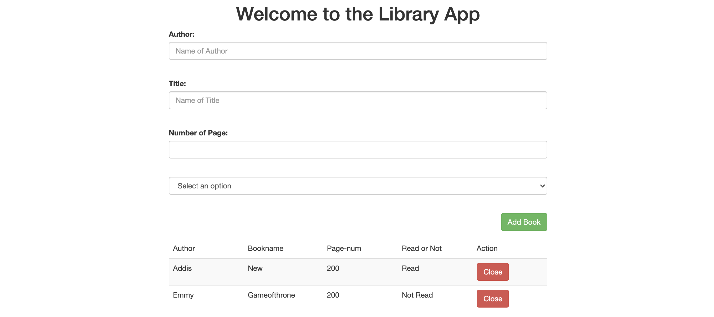

# Project Name :LibraryApp-V1

> In this project, we built a basic web-based library application using JavaScript. One can add books to the library, delete the books, and select the book as to whether read or not. We use local storage to store the data from the user.



## Built With

- Javascript
- Bootstrap
- HTML
- SCSS
- LocalStorage

## Live Demo

[Live Demo Link](https://addis0943.github.io/Library/)

## Getting Started

## To get local copy up and running follow these simple example steps

```
git clone git@github.com:Addis0943/Library.git
```

```
cd Library
```

### Linters.

Install some dependencies by running the following command

```
npm install --save-dev eslint@7.x eslint-config-airbnb-base@14.x eslint-plugin-import@2.x babel-eslint@10.x
```

```
npm install --save-dev stylelint@13.3.x stylelint-scss@3.17.x stylelint-config-standard@20.0.x stylelint-csstree-validator
```

Run the following command to check linters

```
npx eslint .
```

```
npx stylelint "\*_/_.{css,scss}"
```

### Deployment

```
Install and run a live server plugin on your Text editor.
```

👤 **Addis Belete**

- GitHub: [@Addis0943](https://github.com/Addis0943)
- Twitter: [@Addis32018084](https://twitter.com/Addis32018084)
- LinkedIn: [LinkedIn](https://www.linkedin.com/in/addis-belete-134b98191/)

👤 **NSABIMANA Emmanuel**

- GitHub: [@emmyn5600](https://github.com/Emmyn5600)
- Twitter: [@NSABIMA62253884](https://twitter.com/NSABIMA62253884)
- LinkedIn: [@nsabimana-emmanuel-4276091b2](https://www.linkedin.com/in/nsabimana-emmanuel-4276091b2/)

## 🤝 Contributing

Contributions, issues, and feature requests are welcome!

Feel free to check the [issues page](https://github.com/Addis0943/Capstone-Project/issues/3/).

## Show your support

Give a ⭐️ if you like this project!

## Acknowledgments

- Hat tip to UI MONK for his videos.

## 📝 License

This project is [MIT](./LICENSE) licensed.
